# Tutorial NodeJS, Express, Atom, GitHub, Cloud9, Markdown y Pandoc
***

## Índice

1. [NodeJS](#node)
2. [Express](#express)
3. [Atom](#atom)
4. [GitHub Desktop](#github)
5. [Cloud 9](#c9)
6. [Markdown](#markdown)
7. [Pandoc](#pandoc)
8. [Enlaces](#enlaces)

## NodeJS {#node}

### ¿Qué es NodeJS?

Es un entorno en tiempo de ejecución multiplataforma, de código abierto, para la capa del servidor. Está basado en el Lenguaje de programación **[ECMAScript](http://www.ecma-international.org/publications/standards/Ecma-262.htm "Especificación del Lenguaje")** basado en **Javascript**. Su objetivo es construir aplicaciones altamente escalables y escribir código que maneje decenas de miles de conexiones simultáneas en una sólo una máquina física.

### Instalación de NodeJS en OS X (x64)

Para empezar descargue el paquete de instalación para **mac** y seguir los pasos del asistente de **NodeJS**. Tal como muestran las dos siguientes imágenes.

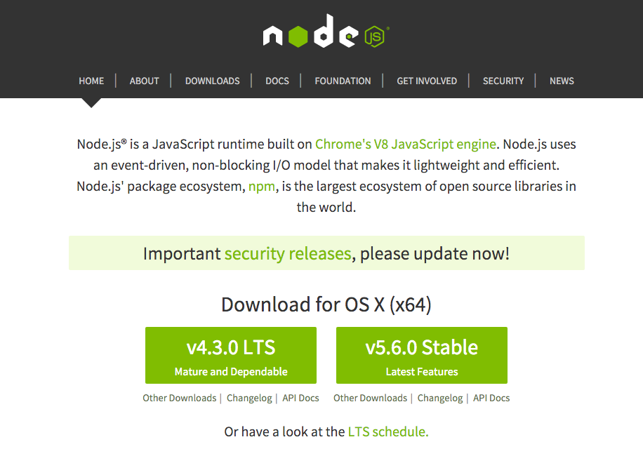{width=50%}

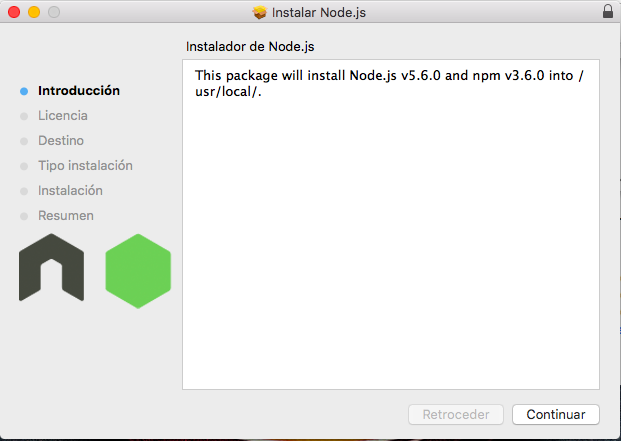{width=50%}

Abrimos un terminal y tecleamos el siguiente comando para comprobar que se ha instalado correctamente:

```bash
$ node --version
```
aparecerá la versión de node que se ha instalado.

### Ejemplos básicos en NodeJS

Escriba en un terminal el comando *node*:

```bash
$ node
>
```

Pruebe a hacer las siguientes operaciones aritméticas y pásele una cadena de texto a una variable:

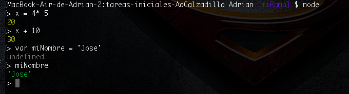{width=50%}

#### npm

Para instalar los paquetes de node se usará el comando **npm**.

## Express {#express}

### ¿Qué es Express?

Express es un framework de aplicaciones web y flexibles de Node.js que proporciona un robusto conjunto de características para la web y aplicaciones móviles.

### Instalación de Express

Para la instalación de este framework usaremos node y el siguiente comando:

```bash
$ npm install express --save
```

#### Ejemplo de uso

Para crear una aplicación con **Express** usa el siguiente comando:

```bash
$ express
```

Se creará la siguiente estructura de carpetas:

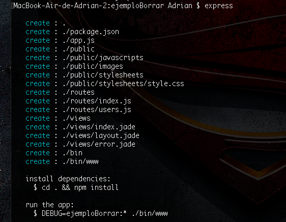{width=40%}

## Atom {#atom}

### ¿Qué es Atom?

Es un editor de texto orientado al desarrollo de aplicaciones. Es una herramienta desarrollada por GitHub. Atom se ha concebido como un editor flexible al que se le pueden añadir nuevas funcionalidades y complementos, además de temas, que nos permitan configurar un espacio de trabajo adaptado a nuestras necesidades.

### Instalación de Atom

Pasos a seguir:

1. Ir a la [página oficial](https://atom.io/ "Atom").
2. Descargar el archivo zip.

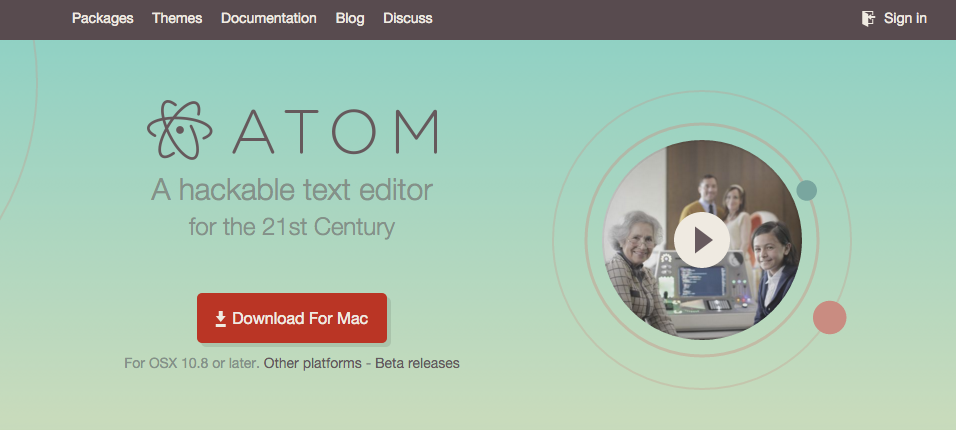{width=50%}

3. Instalar el fichero descargado.

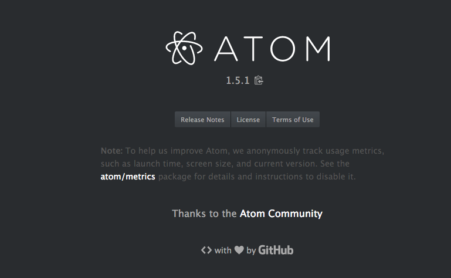{width=50%}

Se usará **Atom** como el editor de texto principal.

## GitHub Desktop {#github}

### ¿Qué es GitHub Desktop?

GitHub es una plataforma para alojar proyectos utilizando el sistema de control de versiones *git*. **GitHub Desktop** simplemente es una interfaz de usuario que nos permite interactuar con *git* sin el uso de ningún comando.

### Instalación de GitHub Desktop

1. Ir a la [página oficial](https://desktop.github.com/ "GitHub desktop")
2. Descargar para Mac.
3. Instalar en su ordenador.

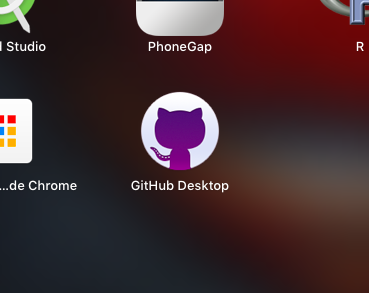{width=30%}

4. Configurar su cuenta de GitHub.

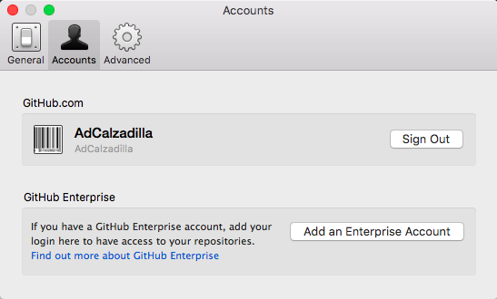{width=50%}

5. Sincronizar los repositorios tanto local como remotos.

## Cloud 9 {#c9}

### ¿Qué es Cloud 9?

Es un programa que se ejecuta sobre el navegador que tiene las funcionalidades más destacadas de un IDE en el que además tenemos un entorno de trabajo real donde podemos poner nuestros programas en ejecución, ya sean sitios web o programas ejecutables.

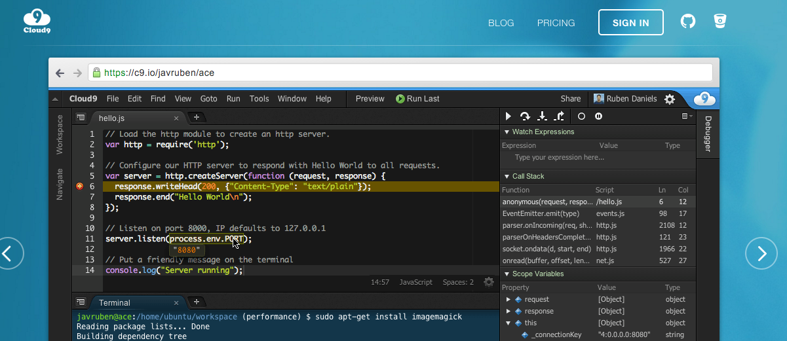{width=50%}

### Darse de alta en Cloud 9

1. Ir a la [página oficial](https://c9.io/ "c9")
2. Crearse una cuenta

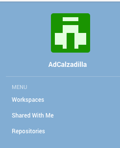{width=20%}

### Crear un nuevo workspace

* Si disponemos de algún proyecto en un repositorio de GitHub podremos asociarlo a **Cloud9** para trabajar en él tan solo creando un “`nuevo workspace`” y añadiendo la url *git* del correspondiente repositorio.

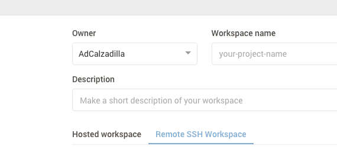{width=50%}

* Otra ventaja de **Cloud9** es que permite el trabajo en equipo en el IDE añadiendo miembros a tu workspace.

## Markdown {#markdown}

### ¿Qué es Markdown?

Markdown es un lenguaje de marcado que facilita la aplicación de formato a un texto empleando una serie de caracteres de una forma especial. En principio, fue pensado para elaborar textos cuyo destino iba a ser la web con más rapidez y sencillez que si estuviésemos empleando directamente HTML.

### Sintaxis


#### Encabezados

```
# Encabezado H1
## Encabezado H2
### Encabezado H3
```
#### Tipografía

```
**Negrita**
*Cursiva*
> Citas
Parrafo (separar por lineas en blanco)
`Codigo`
```

#### Imágenes y Links

```

* [Links](https://example.com)
```
#### Listas

* Lista Ordenada

```
1. Elemento 1
2. Elemento 2
```

* Lista **no** Ordenada

```
* Elemento A
* Elemento B
```

#### Tablas

```
| Cabecera A | Cabecera B |
| ---------- | ---------- |
| Campo A0   | Campo B0   |
| Campo A1   | Campo B1   |
```

## Pandoc {#pandoc}

### ¿Qué es Pandoc?

Programa al cual se le pasa un tipo de fichero y lo convierte al formato que desee.

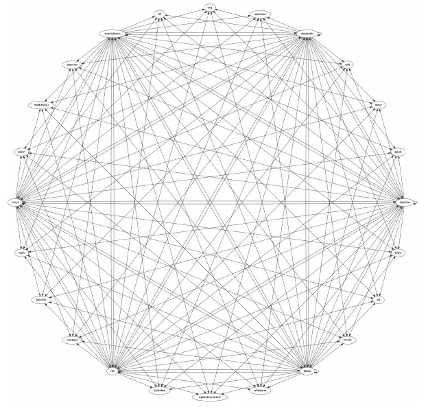{width=30%}

### Instalación de Pandoc

1. Vaya a la página oficial de Pandoc al apartado de [instalación](http://pandoc.org/installing.html).
2. Descargue el paquete adecuado para su sistema operativo.
3. Instalar.

#### Ejemplo de uso:

* Pasar de Markdown a HTML.

```bash
$ pandoc README.md -o example1.html
```

#### Comando exacto para crear este documento:

```bash
$ pandoc -s -c index.css index.md -o index.html
```

Las funciones **-s**, **-c** introducen una cabecera y un fichero **css** respectivamente.

## Enlaces {#enlaces}

* [NodeJS](https://nodejs.org)
* [Express](http://expressjs.com)
* [Atom IDE](https://atom.io)
* [GitHub Desktop](https://desktop.github.com)
* [Cloud 9 IDE](https://c9.io)
* [Markdown](http://joedicastro.com/pages/markdown.html#mark10)
